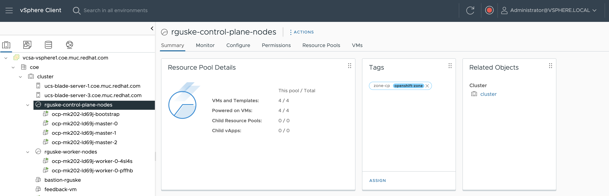

# OpenShift Installer Provisioned Infrastructure (IPI) with vSphere FailureDomains

This OpenShift installation on VMware vSphere will make use of the IPI feature `FailureDomains` in order to place the nodes in specific resource types like e.g. a vSphere cluster, resource pool and or VM folder. Furthermore, it'll configure the different nodes types with different networks (separation).



- [OpenShift Installer Provisioned Infrastructure (IPI) with vSphere FailureDomains](#openshift-installer-provisioned-infrastructure-ipi-with-vsphere-failuredomains)
  - [Installation](#installation)
    - [Installing necessary CLIs](#installing-necessary-clis)
    - [Add the vCenter Root Certificates for the IPI cli](#add-the-vcenter-root-certificates-for-the-ipi-cli)
    - [Create install-config.yaml using the openshift-installer](#create-install-configyaml-using-the-openshift-installer)
  - [RHEL9 Router Installation](#rhel9-router-installation)
    - [`subscription-manager` Setup](#subscription-manager-setup)
    - [RHEL9 Router Installation - Network](#rhel9-router-installation---network)
    - [Enable IP Forwarding](#enable-ip-forwarding)
    - [Configure the Firewall](#configure-the-firewall)
    - [Setup DHCP Server](#setup-dhcp-server)

## Installation

My use case was to deploy an OpenShift cluster in two FailureDomains. In my setup, the FailureDomains are vSphere Resource Pools. The Resources/FailureDomains must be tagged with the vSphere Tags accordingly.

```code
export GOVC_URL='' \
export GOVC_USERNAME='administrator@vsphere.local' \
export GOVC_PASSWORD='' \
export GOVC_INSECURE=1
```

Tag Categories:

```code
govc tags.category.ls

openshift-zone
openshift-region
```

Tags:

```code
> govc tags.ls -c openshift-region
region-1  openshift-region

> govc tags.ls -c openshift-zone
zone-worker  openshift-zone
zone-cp      openshift-zone
```

I also had to configre a RHEL router which serves the communication between two different VLANs which can't a) communicate with each other and which b) have no internet access. The router setup is documented [here](#rhel9-router-installation).

### Installing necessary CLIs

On the bastion host, download the necessary cli's:

`curl -LO <url>`

- [openshift-install-rhel9](https://mirror.openshift.com/pub/openshift-v4/clients/ocp/4.20.11/openshift-install-linux-4.20.11.tar.gz)
  - `curl -LO https://mirror.openshift.com/pub/openshift-v4/clients/ocp/4.20.11/openshift-install-linux-4.20.11.tar.gz`
- [openshift-client-linux-amd64](https://mirror.openshift.com/pub/openshift-v4/clients/ocp/4.20.11/openshift-client-linux-4.20.11.tar.gz)
  - `curl -LO https://mirror.openshift.com/pub/openshift-v4/clients/ocp/4.20.11/openshift-client-linux-4.20.11.tar.gz`

Unpack the `.gz`files and copy them into your path:

If /usr/local/bin isn't included in the $PATH, run
`export PATH=/usr/local/bin:$PATH`

```shell
cp openshift-install /usr/local/bin/
cp oc /usr/local/bin/
cp kubectl /usr/local/bin/
```

### Add the vCenter Root Certificates for the IPI cli

- [Adding your vCenter’s trusted root CA certificates](https://docs.redhat.com/en/documentation/openshift_container_platform/4.17/html/installing_on_vmware_vsphere/installer-provisioned-infrastructure#installation-adding-vcenter-root-certificates_ipi-vsphere-preparing-to-install) to your system trust.
- Downloading and adding the certificates: `curl -kLO https://vcsa-vsphere1.coe.muc.redhat.com/certs/download.zip`
- Install `unzip` to unpack the zip file: `sudo dnf install unzip -y`.
- Unpack the zip file: `unzip download.zip`.
- Move the certificates to the system trust: `cp certs/lin/* /etc/pki/ca-trust/source/anchors`
- Update your system trust: `update-ca-trust extract`

### Create install-config.yaml using the openshift-installer

Create the installation configuration for OCP interactively by executing: `openshift-install create install-config --dir .`

```shell
openshift-install create install-config --dir .
? SSH Public Key /home/rguske/.ssh/id_rsa.pub
? Platform vsphere
? vCenter vcsa-....com
? Username administrator@vsphere...
? Password [? for help] ********
INFO Connecting to vCenter vcsa-...com
INFO Defaulting to only available datacenter: coe
INFO Defaulting to only available cluster: /coe/host/cluster
? Default Datastore /coe/datastore/shared-netapp
INFO Defaulting to only available network: VM Network
? Virtual IP Address for API 192.168.202.2
? Virtual IP Address for Ingress 192.168.202.3
? Base Domain rguske......com
? Cluster Name ocp1
? Pull Secret [? for help] ****************************************************************************************************************************************************************************************
INFO Install-Config created in: .
```

The created `install-config.yaml` does not include the necessary configurations for the use case. This is the final version of the working configuration:

```yaml
additionalTrustBundlePolicy: Proxyonly
apiVersion: v1
baseDomain: rguske.coe.muc.redhat.com
controlPlane:
  architecture: amd64
  hyperthreading: Enabled
  name: master
  platform:
    vsphere:
      zones: [cp-domain]
  replicas: 3
compute:
- architecture: amd64
  hyperthreading: Enabled
  name: worker
  platform:
    vsphere:
      zones: [worker-domain]
  replicas: 2
metadata:
  name: ocp-mk202
networking:
  clusterNetwork:
  - cidr: 10.128.0.0/14
    hostPrefix: 23
  machineNetwork:
  - cidr: 192.168.202.0/24
  - cidr: 192.168.204.0/24
  networkType: OVNKubernetes
  serviceNetwork:
  - 172.30.0.0/16
platform:
  vsphere:
    apiVIPs:
    - 192.168.202.2
    regionType: Datacenter
    failureDomains:
    - name: cp-domain
      region: region-1
      zone: zone-cp
      server: vcsa-vsphere1.coe.muc.redhat.com
      topology:
        datacenter: coe
        computeCluster: /coe/host/cluster
        resourcePool: /coe/host/cluster/Resources/rguske-control-plane-nodes
        folder: /coe/vm/rguske-control-plane-nodes
        datastore: /coe/datastore/shared-netapp
        networks:
        - user-vlan-2002
    - name: worker-domain
      region: region-1
      zone: zone-worker
      server: vcsa-vsphere1.coe.muc.redhat.com
      topology:
        datacenter: coe
        computeCluster: /coe/host/cluster
        resourcePool: /coe/host/cluster/Resources/rguske-worker-nodes
        folder: /coe/vm/rguske-compute-nodes
        datastore: /coe/datastore/shared-netapp
        networks:
        - user-vlan-2004
    ingressVIPs:
    - 192.168.202.3
    vcenters:
    - datacenters:
      - coe
      password: ******
      port: 443
      server: vcsa-vsphere...
      user: administrator@vsphere.local
publish: External
pullSecret: '{"auths":{"cloud.openshift.com":...}}'
sshKey: |
  ssh-ed25519 AA...
```

## RHEL9 Router Installation

- Installed basic RHEL9 VM on vSphere
  - set hostname
  - configure network
  - select installation source and destination
  - add a new user
    - set passwords

### `subscription-manager` Setup

If not already done during installation:

```code
subscription-manager register --org="" --activationkey=""
```

Checkt the repos:

```code
dnf repolist
Updating Subscription Management repositories.
repo id                                                                                   repo name
rhel-9-for-x86_64-appstream-rpms                                                          Red Hat Enterprise Linux 9 for x86_64 - AppStream (RPMs)
rhel-9-for-x86_64-baseos-rpms                                                             Red Hat Enterprise Linux 9 for x86_64 - BaseOS (RPMs)
```

- needed packages post-install:

```code
dnf install -y \
  dnsmasq \
  firewalld \
  tcpdump \
  bind-utils \
  vim
```

### RHEL9 Router Installation - Network

VM got configured with three vNICs. Each assigned to a specific Distributed Port-Group in vSphere:

```code
ip -br a

lo               UNKNOWN        127.0.0.1/8 ::1/128
ens33            UP             10.32.111.8/20 2620:52:0:2060:250:56ff:fe88:71f7/64 fe80::250:56ff:fe88:71f7/64
ens34            UP             192.168.202.10/24 fe80::2e60:26f7:eca5:3311/64
ens35            UP             192.168.204.10/24 fe80::4659:fe20:d534:9e48/64
```

`ens33` is connected to a DHCP network and has already got an IP assigned.

Network 2 and 3 will be static.

```code
nmcli con add type ethernet ifname ens34 con-name lan2 \
  ipv4.method manual ipv4.addresses 192.168.202.10/24
```

```code
nmcli con add type ethernet ifname ens35 con-name lan3 \
  ipv4.method manual ipv4.addresses 192.168.204.10/24
```

Activate ncs:

```code
nmcli con up lan2 && nmcli con up lan3
```

### Enable IP Forwarding

Enable IP Forwarding (Mandatory):

```code
echo "net.ipv4.ip_forward = 1" > /etc/sysctl.d/99-router.conf \
sysctl --system
```

### Configure the Firewall

Configure Firewall and NAT (firewalld):

RHEL 9 uses nftables via firewalld.

```code
firewall-cmd --permanent --zone=external --add-interface=ens33
firewall-cmd --permanent --zone=internal --add-interface=ens34
firewall-cmd --permanent --zone=internal --add-interface=ens35
```

Enable Masquerading on WAN:

```code
firewall-cmd --permanent --zone=external --add-masquerade
firewall-cmd --permanent --zone=internal --add-masquerade
```

Allow Forwarding Between Zones:

```code
firewall-cmd --permanent --zone=internal --add-forward
```

Configure Policies accordingly:

```code
sudo firewall-cmd --permanent --new-policy=internal-external
sudo firewall-cmd --permanent --policy=internal-external --set-target=ACCEPT
sudo firewall-cmd --permanent --policy=internal-external --add-masquerade
sudo firewall-cmd --permanent --policy=internal-external --add-ingress-zone=internal
sudo firewall-cmd --permanent --policy=internal-external --add-egress-zone=external
sudo firewall-cmd --reload
```

```code
firewall-cmd --reload
```

### Setup DHCP Server

Install and Configure DHCP (dnsmasq). `dnsmasq` is lightweight and ideal for this role.

```code
dnf install -y dnsmasq
```

Configuration

Edit `/etc/dnsmasq.d/router.conf`:

```code
# Network 2
interface=ens34
dhcp-range=ens34,192.168.202.100,192.168.202.150,12h
dhcp-option=ens34,option:router,192.168.202.10
dhcp-option=ens34,option:dns-server,10.32.96.1

# Network 3
interface=ens35
dhcp-range=ens35,192.168.204.100,192.168.204.150,12h
dhcp-option=ens35,option:router,192.168.204.10
dhcp-option=ens35,option:dns-server,10.32.96.1
```

Start and Enable:

```code
systemctl enable --now dnsmasq
```

The leases can be read using `tail -f /var/lib/dnsmasq/dnsmasq.leases`.

Firewall: Allow DHCP Traffic:

```code
firewall-cmd --permanent --zone=internal --add-service=dhcp
firewall-cmd --reload
```
